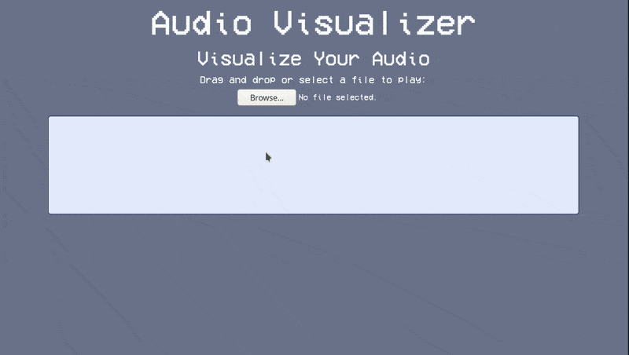

# Audio Visualizer

## Table of contents
* [Overview](#overview)
* [Examples](#examples)
* [Technologies](#technologies)
* [Usage](#usage)
* [Limitations](#limitations)

## Overview
Drag and drop an audio file or select it from your file system to upload it to the website. The website will play the audio back and while it doing so, it will display some information in a grid of varying shades of blue. The grid visualizes how much sound is present across the entire audio spectrum. A lighter shade of blue indicates more sound on the spectrum, and a darker shade indicates less sound.

## Examples

> Video recording a song being visualized

## Technologies
- **JavaScript**
- **HTML / CSS**
- **HTML5 Audio API**
- **Bootstrap 4.5**

## Usage
*To be updated*
Download the code and run the `index.html` file

## Limitations
- [ ] Currently no pause or resume functionality

## License
Licensed under the [GNU General Public License v3.0](LICENSE).
